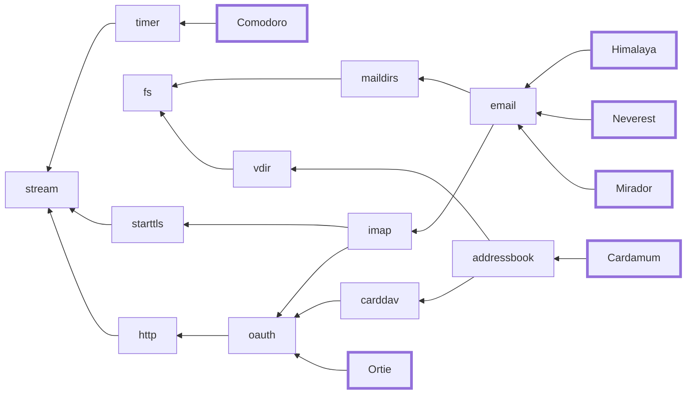

# Pimalaya

Pimalaya is an ambitious project that aims to **improve open-source tools** related to **Personal Information Management** (as known as [PIM](https://en.wikipedia.org/wiki/Personal_information_manager)) which includes emails, contacts, calendars, tasks and more.

Pimalaya has **two objectives**:

1. Provide **I/O-free** [Rust](https://www.rust-lang.org) libraries dedicated to the PIM domain. They serve as a basis for all sorts of top-level applications, which prevents developers to reinvent the wheel.
2. Provide quality house-made **applications** built on top of these libraries, gathered into projects.

## 📫 Email

*🚧 This domain is being refactored, stay tuned! 🚧*

### Projects

#### Himalaya

Himalaya was the first project of Pimalaya. It strives to be everything you need to **manage emails**.

- [CLI](https://github.com/pimalaya/himalaya)
- [REPL](https://github.com/pimalaya/himalaya-repl)
- GUI (planned)
- [Vim plugin](https://github.com/pimalaya/himalaya-vim)
- [Emacs plugin](https://github.com/dantecatalfamo/himalaya-emacs)
- [Raycast extension](https://www.raycast.com/jns/himalaya)
	    
#### Neverest

Neverest is the project dedicated to email **synchronization** and **backup**. It is a direct concurrent to [OfflineIMAP](https://www.offlineimap.org/) and [mbsync](https://isync.sourceforge.io/mbsync.html).

- [CLI](https://github.com/pimalaya/neverest)
	    
#### Mirador

Mirador is the project dedicated to mailbox monitoring. Its aim is to **watch mailboxes changes** and execute action like sending system notification or running shell commands.

- [CLI](https://github.com/pimalaya/mirador)

#### MML

This small project gathers everything related to the Emacs MIME Message Meta Language, as known as [MML](https://www.gnu.org/software/emacs/manual/html_node/emacs-mime/Composing.html):

> Creating a MIME message is boring and non-trivial. Therefore, a library called mml has been defined that parses a language called MML (MIME Meta Language) and generates MIME messages.

The two main use cases of the project are:

1. You want to write a MIME message from scratch or you want to edit an existing one (reply, forward): they can be written in MML then compiled into MIME messages as defined in the [RFC 2045](https://www.rfc-editor.org/rfc/rfc2045).
2. You want to read a MIME message: they can be interpreted as MML messages, which are way more human-readable than MIME messages.

- [CLI](https://github.com/pimalaya/mml)
- [Vim plugin](https://github.com/pimalaya/mml-vim)

## ⌛ Timer

### Libraries

- [timer](https://github.com/pimalaya/io-timer): Set of I/O-free Rust coroutines to manage timers

### Projects

#### Comodoro

Comodoro strives to be everything you need to **manage timers**. The main use case is to track your worktime. A good example is the [Pomodoro Technique](https://en.wikipedia.org/wiki/Pomodoro_Technique).

- [CLI](https://github.com/pimalaya/comodoro)
- [Raycast extension](https://www.raycast.com/jns/comodoro)

## 📇 Contacts

*🚧 This domain is being refactored, stay tuned! 🚧*

## 🔒 Security

### Libraries

- [oauth](https://github.com/pimalaya/io-oauth): Set of I/O-free Rust coroutines to manage OAuth flows

## Sponsoring

Special thanks to the [NLnet foundation](https://nlnet.nl/) and the [European Commission](https://www.ngi.eu/) that helped the project to receive financial support from various programs:

- [NGI Assure](https://nlnet.nl/project/Himalaya/) in 2022
- [NGI Zero Entrust](https://nlnet.nl/project/Pimalaya/) in 2023
- [NGI Zero Core](https://nlnet.nl/project/Pimalaya-PIM/) in 2024 *(still ongoing)*

If you appreciate the project, feel free to donate using one of the following providers:

[![thanks.dev](https://img.shields.io/badge/-thanks.dev-000000?logo=data:image/svg+xml;base64,PHN2ZyB3aWR0aD0iMjQuMDk3IiBoZWlnaHQ9IjE3LjU5NyIgY2xhc3M9InctMzYgbWwtMiBsZzpteC0wIHByaW50Om14LTAgcHJpbnQ6aW52ZXJ0IiB4bWxucz0iaHR0cDovL3d3dy53My5vcmcvMjAwMC9zdmciPjxwYXRoIGQ9Ik05Ljc4MyAxNy41OTdINy4zOThjLTEuMTY4IDAtMi4wOTItLjI5Ny0yLjc3My0uODktLjY4LS41OTMtMS4wMi0xLjQ2Mi0xLjAyLTIuNjA2di0xLjM0NmMwLTEuMDE4LS4yMjctMS43NS0uNjc4LTIuMTk1LS40NTItLjQ0Ni0xLjIzMi0uNjY5LTIuMzQtLjY2OUgwVjcuNzA1aC41ODdjMS4xMDggMCAxLjg4OC0uMjIyIDIuMzQtLjY2OC40NTEtLjQ0Ni42NzctMS4xNzcuNjc3LTIuMTk1VjMuNDk2YzAtMS4xNDQuMzQtMi4wMTMgMS4wMjEtMi42MDZDNS4zMDUuMjk3IDYuMjMgMCA3LjM5OCAwaDIuMzg1djEuOTg3aC0uOTg1Yy0uMzYxIDAtLjY4OC4wMjctLjk4LjA4MmExLjcxOSAxLjcxOSAwIDAgMC0uNzM2LjMwN2MtLjIwNS4xNTYtLjM1OC4zODQtLjQ2LjY4Mi0uMTAzLjI5OC0uMTU0LjY4Mi0uMTU0IDEuMTUxVjUuMjNjMCAuODY3LS4yNDkgMS41ODYtLjc0NSAyLjE1NS0uNDk3LjU2OS0xLjE1OCAxLjAwNC0xLjk4MyAxLjMwNXYuMjE3Yy44MjUuMyAxLjQ4Ni43MzYgMS45ODMgMS4zMDUuNDk2LjU3Ljc0NSAxLjI4Ny43NDUgMi4xNTR2MS4wMjFjMCAuNDcuMDUxLjg1NC4xNTMgMS4xNTIuMTAzLjI5OC4yNTYuNTI1LjQ2MS42ODIuMTkzLjE1Ny40MzcuMjYuNzMyLjMxMi4yOTUuMDUuNjIzLjA3Ni45ODQuMDc2aC45ODVabTE0LjMxNC03LjcwNmgtLjU4OGMtMS4xMDggMC0xLjg4OC4yMjMtMi4zNC42NjktLjQ1LjQ0NS0uNjc3IDEuMTc3LS42NzcgMi4xOTVWMTQuMWMwIDEuMTQ0LS4zNCAyLjAxMy0xLjAyIDIuNjA2LS42OC41OTMtMS42MDUuODktMi43NzQuODloLTIuMzg0di0xLjk4OGguOTg0Yy4zNjIgMCAuNjg4LS4wMjcuOTgtLjA4LjI5Mi0uMDU1LjUzOC0uMTU3LjczNy0uMzA4LjIwNC0uMTU3LjM1OC0uMzg0LjQ2LS42ODIuMTAzLS4yOTguMTU0LS42ODIuMTU0LTEuMTUydi0xLjAyYzAtLjg2OC4yNDgtMS41ODYuNzQ1LTIuMTU1LjQ5Ny0uNTcgMS4xNTgtMS4wMDQgMS45ODMtMS4zMDV2LS4yMTdjLS44MjUtLjMwMS0xLjQ4Ni0uNzM2LTEuOTgzLTEuMzA1LS40OTctLjU3LS43NDUtMS4yODgtLjc0NS0yLjE1NXYtMS4wMmMwLS40Ny0uMDUxLS44NTQtLjE1NC0xLjE1Mi0uMTAyLS4yOTgtLjI1Ni0uNTI2LS40Ni0uNjgyYTEuNzE5IDEuNzE5IDAgMCAwLS43MzctLjMwNyA1LjM5NSA1LjM5NSAwIDAgMC0uOTgtLjA4MmgtLjk4NFYwaDIuMzg0YzEuMTY5IDAgMi4wOTMuMjk3IDIuNzc0Ljg5LjY4LjU5MyAxLjAyIDEuNDYyIDEuMDIgMi42MDZ2MS4zNDZjMCAxLjAxOC4yMjYgMS43NS42NzggMi4xOTUuNDUxLjQ0NiAxLjIzMS42NjggMi4zNC42NjhoLjU4N3oiIGZpbGw9IiNmZmYiLz48L3N2Zz4=)](https://thanks.dev/soywod)

