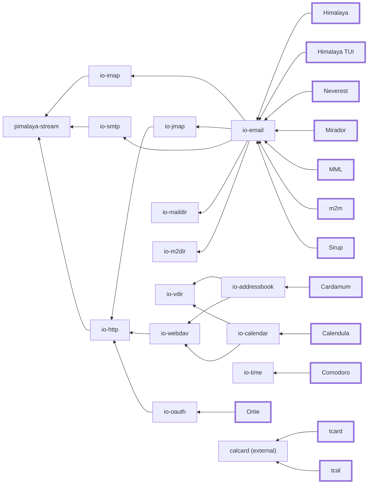

# Pimalaya

Pimalaya is an ambitious project that aims to **improve open-source tools** related to **Personal Information Management** (as known as [PIM](https://en.wikipedia.org/wiki/Personal_information_manager)) which includes emails, contacts, calendars, tasks and more.

Pimalaya has **two objectives**:

1. Provide **I/O-free** [Rust](https://www.rust-lang.org) libraries dedicated to the PIM domain. They serve as a basis for all sorts of top-level applications, which prevents developers to reinvent the wheel.
2. Provide quality house-made **applications** built on top of these libraries, gathered into projects.

Applications also share a small framework that is not shown above: [pimalaya-cli](https://github.com/pimalaya/cli), [pimalaya-config](https://github.com/pimalaya/config) and [pimalaya-tui](https://github.com/pimalaya/tui) for argument parsing, configuration and terminal UI, plus [pimconf](https://github.com/pimalaya/pimconf) for service discovery (autoconfig, DNS SRV, well-known URLs).

> 🧭 **New contributor, human or AI?** Read [how Pimalaya works](https://github.com/pimalaya/.github/blob/master/ARCHITECTURE.md) to understand the shared architecture and conventions, then read the `CONTRIBUTING.md` of the repository you want to work on.

## 📫 Email

- [Himalaya CLI](https://github.com/pimalaya/himalaya), a CLI to manage emails
  - [pimalaya/himalaya-vim](https://github.com/pimalaya/himalaya-vim): Vim plugin
  - [dantecatalfamo/himalaya-emacs](https://github.com/dantecatalfamo/himalaya-emacs): Emacs plugin
  - [jns/himalaya](https://www.raycast.com/jns/himalaya): Raycast extension
  - [openclaw/openclaw](https://github.com/openclaw/openclaw/blob/main/skills/himalaya/SKILL.md): OpenClaw SKILL
  - [parisni/dfzf](https://github.com/parisni/dfzf): dfzf integration
- [Himalaya TUI](https://github.com/pimalaya/himalaya-tui), a TUI to manage emails
- [Neverest CLI](https://github.com/pimalaya/neverest), a CLI to synchronize and backup emails
- [Mirador CLI](https://github.com/pimalaya/mirador), a CLI to watch mailbox changes
- [MML CLI](https://github.com/pimalaya/mml), a CLI to convert MIME messages from/into Emacs MIME Meta Language
  - [pimalaya/mml-vim](https://github.com/pimalaya/mml-vim): Vim plugin
- [m2m CLI](https://github.com/pimalaya/m2m), a CLI to convert between Maildir, Maildir++ and m2dir stores
- [Sirup CLI](https://github.com/pimalaya/sirup), a CLI to spawn pre-authenticated IMAP/SMTP sessions and expose them over Unix sockets

## ⌛ Time

- [Comodoro CLI](https://github.com/pimalaya/comodoro), a CLI to manage timers
  - [jns/comodoro](https://www.raycast.com/jns/comodoro): Raycast extension

## 📇 Contact

- [Cardamum CLI](https://github.com/pimalaya/cardamum), a CLI to manage contacts
- [tcard CLI & lib](https://github.com/pimalaya/tcard), a CLI & lib to edit vCards as ergonomic TOML

## 📅 Calendar

- [Calendula CLI](https://github.com/pimalaya/calendula), a CLI to manage calendar events
- [tcal CLI & lib](https://github.com/pimalaya/tcal), a CLI & lib to edit iCalendars as ergonomic TOML

## 🔒 Security

- [Ortie CLI & lib](https://github.com/pimalaya/ortie), to manage OAuth 2.0 tokens

## ⚙️ Configuration

- [Pimconf CLI & lib](https://github.com/pimalaya/pimconf), to discover PIM-related services and manage configuration

## 🧰 Libraries

All libraries are **I/O-free** (`no_std` coroutines with an optional `std` client). See [how Pimalaya works](https://github.com/pimalaya/.github/blob/master/ARCHITECTURE.md) for the shared design.

- Email: [io-email](https://github.com/pimalaya/io-email), [io-imap](https://github.com/pimalaya/io-imap), [io-jmap](https://github.com/pimalaya/io-jmap), [io-smtp](https://github.com/pimalaya/io-smtp), [io-maildir](https://github.com/pimalaya/io-maildir), [io-m2dir](https://github.com/pimalaya/io-m2dir)
- Contact & calendar: [io-addressbook](https://github.com/pimalaya/io-addressbook), [io-calendar](https://github.com/pimalaya/io-calendar), [io-vdir](https://github.com/pimalaya/io-vdir), [io-webdav](https://github.com/pimalaya/io-webdav)
- Transport & misc: [io-http](https://github.com/pimalaya/io-http), [io-oauth](https://github.com/pimalaya/io-oauth), [io-time](https://github.com/pimalaya/io-time), [pimalaya-stream](https://github.com/pimalaya/stream)
- Application framework: [pimalaya-cli](https://github.com/pimalaya/cli), [pimalaya-config](https://github.com/pimalaya/config), [pimalaya-tui](https://github.com/pimalaya/tui), [pimconf](https://github.com/pimalaya/pimconf)

## Social

- Chat on [Matrix](https://matrix.to/#/#pimalaya:matrix.org)
- News on [Mastodon](https://fosstodon.org/@pimalaya) or [RSS](https://fosstodon.org/@pimalaya.rss)
- Mail at [pimalaya.org@posteo.net](mailto:pimalaya.org@posteo.net)

## Sponsoring

Special thanks to the [NLnet foundation](https://nlnet.nl/) and the [European Commission](https://www.ngi.eu/) that have been financially supporting the project for years:

- 2022 → 2023: [NGI Assure](https://nlnet.nl/project/Himalaya/)
- 2023 → 2024: [NGI Zero Entrust](https://nlnet.nl/project/Pimalaya/)
- 2024 → 2026: [NGI Zero Core](https://nlnet.nl/project/Pimalaya-PIM/)
- *2027 in preparation…*

If you appreciate the project, feel free to donate using one of the following providers:

[![thanks.dev](https://img.shields.io/badge/-thanks.dev-000000?logo=data:image/svg+xml;base64,PHN2ZyB3aWR0aD0iMjQuMDk3IiBoZWlnaHQ9IjE3LjU5NyIgY2xhc3M9InctMzYgbWwtMiBsZzpteC0wIHByaW50Om14LTAgcHJpbnQ6aW52ZXJ0IiB4bWxucz0iaHR0cDovL3d3dy53My5vcmcvMjAwMC9zdmciPjxwYXRoIGQ9Ik05Ljc4MyAxNy41OTdINy4zOThjLTEuMTY4IDAtMi4wOTItLjI5Ny0yLjc3My0uODktLjY4LS41OTMtMS4wMi0xLjQ2Mi0xLjAyLTIuNjA2di0xLjM0NmMwLTEuMDE4LS4yMjctMS43NS0uNjc4LTIuMTk1LS40NTItLjQ0Ni0xLjIzMi0uNjY5LTIuMzQtLjY2OUgwVjcuNzA1aC41ODdjMS4xMDggMCAxLjg4OC0uMjIyIDIuMzQtLjY2OC40NTEtLjQ0Ni42NzctMS4xNzcuNjc3LTIuMTk1VjMuNDk2YzAtMS4xNDQuMzQtMi4wMTMgMS4wMjEtMi42MDZDNS4zMDUuMjk3IDYuMjMgMCA3LjM5OCAwaDIuMzg1djEuOTg3aC0uOTg1Yy0uMzYxIDAtLjY4OC4wMjctLjk4LjA4MmExLjcxOSAxLjcxOSAwIDAgMC0uNzM2LjMwN2MtLjIwNS4xNTYtLjM1OC4zODQtLjQ2LjY4Mi0uMTAzLjI5OC0uMTU0LjY4Mi0uMTU0IDEuMTUxVjUuMjNjMCAuODY3LS4yNDkgMS41ODYtLjc0NSAyLjE1NS0uNDk3LjU2OS0xLjE1OCAxLjAwNC0xLjk4MyAxLjMwNXYuMjE3Yy44MjUuMyAxLjQ4Ni43MzYgMS45ODMgMS4zMDUuNDk2LjU3Ljc0NSAxLjI4Ny43NDUgMi4xNTR2MS4wMjFjMCAuNDcuMDUxLjg1NC4xNTMgMS4xNTIuMTAzLjI5OC4yNTYuNTI1LjQ2MS42ODIuMTkzLjE1Ny40MzcuMjYuNzMyLjMxMi4yOTUuMDUuNjIzLjA3Ni45ODQuMDc2aC45ODVabTE0LjMxNC03LjcwNmgtLjU4OGMtMS4xMDggMC0xLjg4OC4yMjMtMi4zNC42NjktLjQ1LjQ0NS0uNjc3IDEuMTc3LS42NzcgMi4xOTVWMTQuMWMwIDEuMTQ0LS4zNCAyLjAxMy0xLjAyIDIuNjA2LS42OC41OTMtMS42MDUuODktMi43NzQuODloLTIuMzg0di0xLjk4OGguOTg0Yy4zNjIgMCAuNjg4LS4wMjcuOTgtLjA4LjI5Mi0uMDU1LjUzOC0uMTU3LjczNy0uMzA4LjIwNC0uMTU3LjM1OC0uMzg0LjQ2LS42ODIuMTAzLS4yOTguMTU0LS42ODIuMTU0LTEuMTUydi0xLjAyYzAtLjg2OC4yNDgtMS41ODYuNzQ1LTIuMTU1LjQ5Ny0uNTcgMS4xNTgtMS4wMDQgMS45ODMtMS4zMDV2LS4yMTdjLS44MjUtLjMwMS0xLjQ4Ni0uNzM2LTEuOTgzLTEuMzA1LS40OTctLjU3LS43NDUtMS4yODgtLjc0NS0yLjE1NXYtMS4wMmMwLS40Ny0uMDUxLS44NTQtLjE1NC0xLjE1Mi0uMTAyLS4yOTgtLjI1Ni0uNTI2LS40Ni0uNjgyYTEuNzE5IDEuNzE5IDAgMCAwLS43MzctLjMwNyA1LjM5NSA1LjM5NSAwIDAgMC0uOTgtLjA4MmgtLjk4NFYwaDIuMzg0YzEuMTY5IDAgMi4wOTMuMjk3IDIuNzc0Ljg5LjY4LjU5MyAxLjAyIDEuNDYyIDEuMDIgMi42MDZ2MS4zNDZjMCAxLjAxOC4yMjYgMS43NS42NzggMi4xOTUuNDUxLjQ0NiAxLjIzMS42NjggMi4zNC42NjhoLjU4N3oiIGZpbGw9IiNmZmYiLz48L3N2Zz4=)](https://thanks.dev/soywod)

